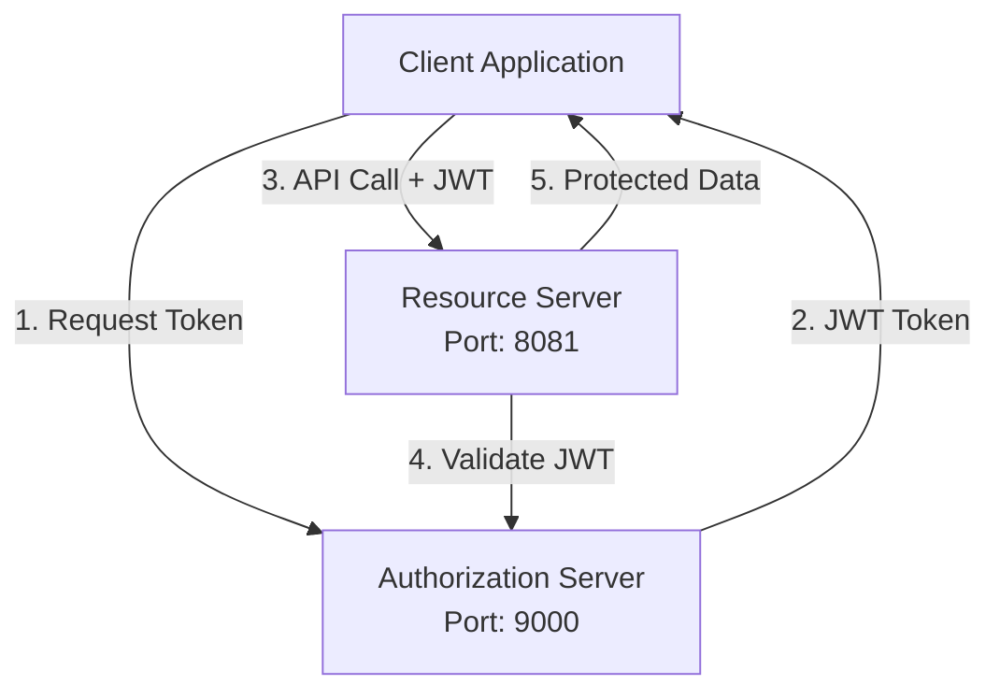

# OAuth2 Authorization Server và Resource Server

Dự án này minh họa cách xây dựng và tích hợp **OAuth2 Authorization Server** và **Resource Server** sử dụng Spring Security.

## 📋 Mục lục
- [Kiến trúc hệ thống](#-kiến-trúc-hệ-thống)
- [Cài đặt và chạy](#-cài-đặt-và-chạy)
- [OAuth2 Grant Types](#-oauth2-grant-types)
- [API Endpoints](#-api-endpoints)
- [Test với cURL](#-test-với-curl)
- [Test với Postman](#-test-với-postman)
- [Troubleshooting](#-troubleshooting)

## 🏗️ Kiến trúc hệ thống



### Các thành phần:

**Authorization Server (Port 9000)**:
- Xác thực người dùng
- Cấp phát JWT tokens
- Quản lý OAuth2 clients và scopes

**Resource Server (Port 8081)**:
- Bảo vệ APIs bằng JWT tokens
- Phân quyền dựa trên scopes
- Validate tokens với Authorization Server

## 🚀 Cài đặt và chạy

### Yêu cầu hệ thống:
- Java 17+
- Maven 3.6+
- IDE (IntelliJ IDEA, VS Code, Eclipse)

### 1. Clone và build projects:

```bash
# Build Authorization Server
cd authorization-server
mvn clean package

# Build Resource Server  
cd ../resource-server
mvn clean package
```

### 2. Chạy các services:

**Terminal 1 - Authorization Server:**
```bash
cd authorization-server
mvn spring-boot:run
# Hoặc: java -jar target/authorization-server.jar
```

**Terminal 2 - Resource Server:**
```bash
cd resource-server  
mvn spring-boot:run
# Hoặc: java -jar target/resource-server.jar
```

### 3. Kiểm tra services đang chạy:

```bash
# Authorization Server
curl http://localhost:9000/.well-known/openid_configuration

# Resource Server  
curl http://localhost:8081/api/public/health
```

## 🔐 OAuth2 Grant Types

### 1. Client Credentials Flow (Machine-to-Machine)

**Sử dụng khi**: API-to-API communication, background services

```bash
POST /oauth2/token
Authorization: Basic base64(client_id:client_secret)
Content-Type: application/x-www-form-urlencoded

grant_type=client_credentials&scope=read write
```

### 2. Authorization Code Flow (Web Applications)

**Sử dụng khi**: Web applications với user interaction

```bash
# Step 1: Authorization Request
GET /oauth2/authorize?response_type=code&client_id=my-client&redirect_uri=http://localhost:8080/callback&scope=read+write

# Step 2: Token Exchange
POST /oauth2/token
Authorization: Basic base64(client_id:client_secret)
Content-Type: application/x-www-form-urlencoded

grant_type=authorization_code&code=AUTH_CODE&redirect_uri=http://localhost:8080/callback
```

### 3. Refresh Token Flow

```bash
POST /oauth2/token
Authorization: Basic base64(client_id:client_secret)
Content-Type: application/x-www-form-urlencoded

grant_type=refresh_token&refresh_token=REFRESH_TOKEN
```

## 🌐 API Endpoints

### Authorization Server (Port 9000)

| Endpoint | Mô tả |
|----------|-------|
| `GET /.well-known/openid_configuration` | OIDC Discovery metadata |
| `GET /oauth2/authorize` | Authorization endpoint |
| `POST /oauth2/token` | Token endpoint |
| `GET /oauth2/jwks` | JSON Web Key Set |
| `POST /oauth2/introspect` | Token introspection |
| `POST /oauth2/revoke` | Token revocation |

### Resource Server (Port 8081)

#### Public Endpoints (Không cần authentication)
| Endpoint | Method | Mô tả |
|----------|--------|-------|
| `/api/public/health` | GET | Health check |
| `/api/public/info` | GET | System information |

#### Protected Endpoints
| Endpoint | Method | Scope | Mô tả |
|----------|--------|-------|-------|
| `/api/users` | GET | `read` | Danh sách users |
| `/api/users/{id}` | GET | `read` | Chi tiết user |
| `/api/posts` | GET | `read` | Danh sách posts |
| `/api/posts` | POST | `write` | Tạo post mới |
| `/api/posts/{id}` | PUT | `write` | Cập nhật post |
| `/api/posts/{id}` | DELETE | `write` | Xóa post |
| `/api/products` | GET | `read` | Danh sách products |
| `/api/products` | POST | `write` | Tạo product mới |
| `/api/token/info` | GET | `any` | Thông tin JWT token |

## 💻 Test với cURL

### 1. Test Public APIs
```bash
# Health check
curl http://localhost:8081/api/public/health

# System info
curl http://localhost:8081/api/public/info
```

### 2. Lấy Access Token
```bash
curl -X POST http://localhost:9000/oauth2/token \
  -H "Content-Type: application/x-www-form-urlencoded" \
  -u "my-client:my-secret" \
  -d "grant_type=client_credentials&scope=read write"
```

**Response:**
```json
{
  "access_token": "eyJ0eXAiOiJKV1Q...",
  "scope": "read write", 
  "token_type": "Bearer",
  "expires_in": 3600
}
```

### 3. Test Protected APIs
```bash
# Lưu token vào biến
TOKEN="eyJ0eXAiOiJKV1Q..."

# GET requests (scope: read)
curl -H "Authorization: Bearer $TOKEN" http://localhost:8081/api/users
curl -H "Authorization: Bearer $TOKEN" http://localhost:8081/api/posts
curl -H "Authorization: Bearer $TOKEN" http://localhost:8081/api/products

# POST requests (scope: write)
curl -X POST http://localhost:8081/api/posts \
  -H "Authorization: Bearer $TOKEN" \
  -H "Content-Type: application/json" \
  -d '{
    "title": "Test Post",
    "content": "Nội dung bài viết test"
  }'
```

## 📮 Test với Postman

### Cài đặt Collection

#### 1. Tạo Environment
**Environment Name**: `OAuth2 Demo`

**Variables**:
```
auth_server_url: http://localhost:9000
resource_server_url: http://localhost:8081  
client_id: my-client
client_secret: my-secret
access_token: {{access_token}} (sẽ tự động set)
```

#### 2. Authorization Configuration

**Collection Level Authorization:**
- Type: `OAuth 2.0`
- Grant Type: `Client Credentials`
- Access Token URL: `{{auth_server_url}}/oauth2/token`
- Client ID: `{{client_id}}`
- Client Secret: `{{client_secret}}`
- Scope: `read write`
- Client Authentication: `Send as Basic Auth header`

### Test Requests

#### Request 1: Get Token (Client Credentials)
```
Method: POST
URL: {{auth_server_url}}/oauth2/token
Authorization: Basic Auth
  Username: {{client_id}}  
  Password: {{client_secret}}
Headers:
  Content-Type: application/x-www-form-urlencoded
Body (x-www-form-urlencoded):
  grant_type: client_credentials
  scope: read write

Test Script:
pm.test("Status code is 200", function () {
    pm.response.to.have.status(200);
});

pm.test("Response has access_token", function () {
    var jsonData = pm.response.json();
    pm.expect(jsonData.access_token).to.exist;
    pm.environment.set("access_token", jsonData.access_token);
});
```

#### Request 2: Authorization Code Flow (Manual)
```
Method: GET
URL: {{auth_server_url}}/oauth2/authorize
Params:
  response_type: code
  client_id: {{client_id}}
  redirect_uri: http://localhost:8080/callback
  scope: read write
```

#### Request 3: Exchange Code for Token
```
Method: POST  
URL: {{auth_server_url}}/oauth2/token
Authorization: Basic Auth
  Username: {{client_id}}
  Password: {{client_secret}}
Headers:
  Content-Type: application/x-www-form-urlencoded
Body (x-www-form-urlencoded):
  grant_type: authorization_code
  code: [PASTE_CODE_HERE]
  redirect_uri: http://localhost:8080/callback
```

#### Request 4: Get Users (Protected)
```
Method: GET
URL: {{resource_server_url}}/api/users
Authorization: Bearer Token
  Token: {{access_token}}

Test Script:
pm.test("Status code is 200", function () {
    pm.response.to.have.status(200);
});

pm.test("Response is JSON", function () {
    pm.response.to.be.json;
});
```

#### Request 5: Create Post (Protected)
```
Method: POST
URL: {{resource_server_url}}/api/posts
Authorization: Bearer Token
  Token: {{access_token}}
Headers:
  Content-Type: application/json
Body (JSON):
{
  "title": "Test Post từ Postman",
  "content": "Đây là bài viết test được tạo từ Postman"
}

Test Script:
pm.test("Status code is 200", function () {
    pm.response.to.have.status(200);
});

pm.test("Post created successfully", function () {
    var jsonData = pm.response.json();
    pm.expect(jsonData.success).to.be.true;
});
```

#### Request 6: Token Info
```
Method: GET
URL: {{resource_server_url}}/api/token/info  
Authorization: Bearer Token
  Token: {{access_token}}

Test Script:
pm.test("Token info contains scopes", function () {
    var jsonData = pm.response.json();
    pm.expect(jsonData.data.scopes).to.include("read");
});
```

### Pre-request Scripts (Collection Level)

```javascript
// Auto-refresh token nếu hết hạn
const token = pm.environment.get("access_token");
const tokenExpiry = pm.environment.get("token_expiry");

if (!token || (tokenExpiry && Date.now() > tokenExpiry)) {
    console.log("Token expired or missing, requesting new token...");
    
    pm.sendRequest({
        url: pm.environment.get("auth_server_url") + "/oauth2/token",
        method: 'POST',
        header: {
            'Content-Type': 'application/x-www-form-urlencoded',
            'Authorization': 'Basic ' + btoa(pm.environment.get("client_id") + ":" + pm.environment.get("client_secret"))
        },
        body: {
            mode: 'urlencoded',
            urlencoded: [
                {key: 'grant_type', value: 'client_credentials'},
                {key: 'scope', value: 'read write'}
            ]
        }
    }, function (err, response) {
        if (response.code === 200) {
            const jsonData = response.json();
            pm.environment.set("access_token", jsonData.access_token);
            pm.environment.set("token_expiry", Date.now() + (jsonData.expires_in * 1000));
            console.log("New token obtained successfully");
        } else {
            console.log("Failed to get token:", response.text());
        }
    });
}
```

### Postman Collection Import

**Collection JSON** để import vào Postman:

```json
{
  "info": {
    "name": "OAuth2 Authorization Server",
    "description": "Collection để test OAuth2 Authorization và Resource Server"
  },
  "auth": {
    "type": "oauth2",
    "oauth2": [
      {
        "key": "tokenType",
        "value": "Bearer"
      },
      {
        "key": "accessToken", 
        "value": "{{access_token}}"
      },
      {
        "key": "addTokenTo",
        "value": "header"
      }
    ]
  },
  "item": [
    {
      "name": "Public APIs",
      "item": [
        {
          "name": "Health Check",
          "request": {
            "method": "GET",
            "header": [],
            "url": "{{resource_server_url}}/api/public/health"
          }
        }
      ]
    },
    {
      "name": "OAuth2 Flows", 
      "item": [
        {
          "name": "Client Credentials Token",
          "request": {
            "method": "POST",
            "header": [
              {
                "key": "Content-Type", 
                "value": "application/x-www-form-urlencoded"
              }
            ],
            "body": {
              "mode": "urlencoded",
              "urlencoded": [
                {"key": "grant_type", "value": "client_credentials"},
                {"key": "scope", "value": "read write"}
              ]
            },
            "url": "{{auth_server_url}}/oauth2/token",
            "auth": {
              "type": "basic",
              "basic": [
                {"key": "username", "value": "{{client_id}}"},
                {"key": "password", "value": "{{client_secret}}"}
              ]
            }
          }
        }
      ]
    },
    {
      "name": "Protected APIs",
      "item": [
        {
          "name": "Get Users",
          "request": {
            "method": "GET",
            "url": "{{resource_server_url}}/api/users"
          }
        },
        {
          "name": "Create Post",
          "request": {
            "method": "POST",
            "header": [
              {"key": "Content-Type", "value": "application/json"}
            ],
            "body": {
              "mode": "raw",
              "raw": "{\n  \"title\": \"Test Post\",\n  \"content\": \"Test content\"\n}"
            },
            "url": "{{resource_server_url}}/api/posts"
          }
        }
      ]
    }
  ]
}
```

## 🔍 Troubleshooting

### Các lỗi thường gặp:

#### 1. **401 Unauthorized**
**Nguyên nhân**:
- Không có Authorization header
- Token không hợp lệ hoặc đã hết hạn
- Token format sai

**Khắc phục**:
```bash
# Kiểm tra token còn hiệu lực
curl -H "Authorization: Bearer $TOKEN" http://localhost:8081/api/token/info

# Lấy token mới
curl -X POST http://localhost:9000/oauth2/token \
  -u "my-client:my-secret" \
  -d "grant_type=client_credentials&scope=read write"
```

#### 2. **403 Forbidden**
**Nguyên nhân**:
- Token hợp lệ nhưng không có scope cần thiết
- Endpoint yêu cầu scope cao hơn

**Khắc phục**:
```bash
# Kiểm tra scopes trong token
curl -H "Authorization: Bearer $TOKEN" http://localhost:8081/api/token/info

# Lấy token với scopes phù hợp
curl -X POST http://localhost:9000/oauth2/token \
  -u "my-client:my-secret" \
  -d "grant_type=client_credentials&scope=read write admin"
```

#### 3. **Connection Refused**
**Nguyên nhân**:
- Authorization Server không chạy
- Resource Server không chạy
- Port bị conflicts

**Khắc phục**:
```bash
# Kiểm tra processes đang chạy
netstat -tlnp | grep :9000
netstat -tlnp | grep :8081

# Kiểm tra logs
tail -f authorization-server/logs/app.log
tail -f resource-server/logs/app.log
```

#### 4. **JWT Validation Failed**
**Nguyên nhân**:
- JWK Set URL không đúng
- Clock skew giữa servers
- Key rotation issues

**Khắc phục**:
```bash
# Kiểm tra JWK endpoint
curl http://localhost:9000/oauth2/jwks

# Kiểm tra system time
date

# Restart cả 2 servers
```

### Debug Logs

**Authorization Server logs:**
```bash
tail -f logs/spring.log | grep -E "(JWT|OAuth2|Security)"
```

**Resource Server logs:**
```bash
tail -f logs/spring.log | grep -E "(JWT|ResourceServer|Authentication)"
```

## 📚 Tài liệu tham khảo

- [Spring Security OAuth2](https://spring.io/projects/spring-security-oauth)
- [OAuth 2.0 RFC](https://tools.ietf.org/html/rfc6749)
- [JWT Specification](https://tools.ietf.org/html/rfc7519)
- [OpenID Connect](https://openid.net/specs/openid-connect-core-1_0.html)

## 🤝 Contributing

1. Fork the project
2. Create your feature branch (`git checkout -b feature/AmazingFeature`)
3. Commit your changes (`git commit -m 'Add some AmazingFeature'`)
4. Push to the branch (`git push origin feature/AmazingFeature`)
5. Open a Pull Request

## 📝 License

This project is licensed under the MIT License - see the [LICENSE](LICENSE) file for details.

---

**Happy Coding! 🚀**